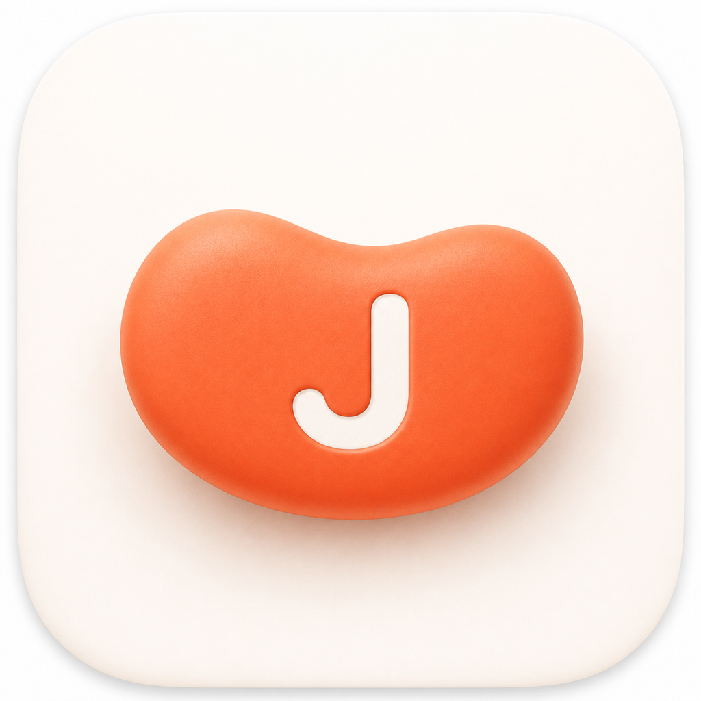

# jelly dict



> **현재 버전: v1.0.1**

**jelly dict**는 영어/일본어 단어를 빠르게 조회해 Excel 단어장에 저장하고, 필요하면 Anki `.apkg` 덱으로 내보내는 **macOS용 로컬 단어장 도구**입니다.

조회한 단어는 Excel 파일에 저장되며, Anki 내보내기도 이 Excel 단어장을 기준으로 생성됩니다.

GitHub 저장소를 다운로드하거나 clone한 뒤, 포함된 installer를 더블클릭하면 개인용 macOS 앱 번들이 생성됩니다.

---

## 주요 기능

- 영어/일본어 단어 조회
- 쉼표/세미콜론으로 여러 단어를 한 번에 대기열에 추가
- Excel 단어장 저장
- 최근 조회 단어 확인 및 검색
- 영어 단어장 / 일본어 단어장 검색 및 정렬
- 저장된 단어의 뜻, 예문, 태그, 메모, 출처 상세 확인
- 선택한 단어 삭제 및 중복 덮어쓰기/병합 전 Excel 자동 백업
- Anki `.apkg` 파일 내보내기
- 사진이나 스크린샷에서 OCR로 단어 후보 추출, 편집, 일괄 조회
- 여러 단어를 대기열에 넣고 순차 조회, 실패 항목 재시도
- 선택 기능으로 TTS 음성이 포함된 Anki 카드 생성

---

## 지원 환경

- macOS
- **Python 3.12 권장**, Python 3.11 지원
- Finder에서 `.command` 파일 실행 가능 환경

Windows와 Linux는 공식 지원 대상이 아닙니다.

installer는 `PySide6>=6.7,<6.11` 범위에서 현재 Python에 맞는 Qt 패키지를 설치합니다. Python 3.13 + Qt 조합은 일부 macOS 26 환경에서 `.app` 실행 시 Cocoa platform plugin 생성 단계에서 abort가 확인되어, installer는 Python 3.12/3.11만 선택합니다. Homebrew 기본 Python이 3.13 이상이면 다음과 같이 호환 버전을 설치한 뒤 다시 실행하세요:

```bash
brew install python@3.12
# 또는
brew install python@3.11
```

특정 Python을 강제하려면 `JELLY_DICT_PYTHON` 환경변수도 사용 가능:

```bash
JELLY_DICT_PYTHON=/opt/homebrew/bin/python3.12 ./Install\ jelly\ dict.command
```

---

## 빠른 시작

처음 사용하는 경우, Finder에서 아래 파일을 더블클릭하세요.

```text
Install jelly dict.command
```

설치가 끝나면 아래 앱을 일반 macOS 앱처럼 실행하세요.

```text
~/Applications/Jelly Dict.app
```

installer 마지막 단계에서 `~/Applications`에 복사하지 않았다면 repo 안의 아래 앱을 실행할 수도 있습니다.

```text
app_files/dist/Jelly Dict.app
```

macOS가 처음 실행 때 보안 경고를 띄우면 파일 또는 앱을 **우클릭 -> 열기**로 실행하세요.

repo 폴더 위치를 옮기면 `Jelly Dict.app` 안에 저장된 원본 경로가 맞지 않게 됩니다. 이 경우 `Install jelly dict.command`를 다시 실행해 앱을 새로 만들면 됩니다.

---

## 설치 흐름

`Install jelly dict.command`는 다음 순서로 진행됩니다.

1. repo 위치와 파일 구조를 확인합니다.
2. Python, 가상환경, 필수 패키지, Playwright WebKit을 점검하고 필요하면 설치/복구합니다.
3. `app_files/dist/Jelly Dict.app`을 생성합니다.
4. `~/Applications`에 복사할지 묻습니다.
5. 완료 후 앱을 바로 실행할지 묻습니다.

생성된 `.app`은 내부에 앱 코드를 복사하지 않고, 원본 repo 경로를 저장한 뒤 내부 환경 점검 스크립트와 실행 스크립트를 감싸서 실행합니다.

---

## 개발자용 실행

jelly dict는 Python 패키지, Playwright WebKit, macOS 권한, 가상환경 상태에 영향을 받습니다.

일반 사용자는 `Install jelly dict.command`로 `.app`을 만든 뒤 실행하는 방식을 권장합니다.

개발자는 필요하면 아래 파일을 직접 사용할 수 있습니다.

```text
Run jelly dict.command
app_files/scripts/quickstart.sh
```

수동 설치나 직접 실행은 문제 해결 범위에 포함하지 않습니다.

문제가 생기면 아래 로그를 먼저 확인하세요.

```text
app_files/jelly_dict/.jelly_dict/logs/quickstart.log
app_files/jelly_dict/.jelly_dict/logs/launcher.log
```

---

## installer가 확인하는 것

`Install jelly dict.command`는 앱 실행 전에 다음 항목을 확인합니다.

- 앱 파일 구조가 원래 배포본과 같은지
- macOS에서 실행 중인지
- Python 3.11 이상이 있는지
- `pip`와 `venv`를 사용할 수 있는지
- 앱 폴더에 쓰기 권한이 있는지
- 디스크 여유 공간이 충분한지
- 폴더 이동 등으로 기존 `.venv`가 깨지지 않았는지
- 필수 Python 패키지가 설치되어 있고 버전이 맞는지
- Playwright WebKit이 설치되어 있는지
- macOS 격리 속성 문제가 있는지
- Rosetta로 잘못 실행 중인지

파일이 빠졌거나 폴더 구조가 바뀐 상태라면 installer는 설치를 중단합니다.
의도한 수정이 아니라면 저장소를 새로 다운로드하거나, git으로 받은 경우 `git pull` 후 다시 실행하는 편이 안전합니다.

---

## 설치 방식

installer는 먼저 라이선스 동의를 받은 뒤, 설치가 필요한 경우 설치 방식을 물어봅니다.

### 권장: 전용 가상환경 사용

앱 폴더 안의 `.venv`에만 필요한 패키지를 설치합니다.  
기존 Python 환경을 덜 건드리기 때문에 특별한 이유가 없다면 이 방식을 권장합니다.

### 선택: 현재 로컬 Python에 설치

이미 Python 환경을 직접 관리하고 있고, 현재 환경에 패키지를 설치해도 괜찮은 경우에만 선택하세요.

---

## 기본 사용 흐름

1. 메인 입력창에 단어를 입력합니다. 여러 단어는 `apple, banana`처럼 쉼표나 세미콜론으로 구분해 한 번에 넣을 수 있습니다.
2. 자동 감지, English, 日本語 중 하나를 선택합니다.
3. 조회 버튼을 누릅니다.
4. 저장 전 미리보기를 켜둔 경우 내용을 확인한 뒤 저장합니다.
5. 저장된 단어는 아래 단어장 영역에서 확인할 수 있습니다.

사진이나 스크린샷에서 단어를 뽑고 싶다면 사진 아이콘을 누르거나 이미지를 붙여넣으세요.  
OCR 후보가 나오면 필요한 단어를 선택해 조회할 수 있습니다. 후보는 더블클릭으로 수정하고 우클릭으로 삭제할 수 있습니다.

여러 후보를 선택하거나 `선택/전체 후보 조회`를 누르면 대기열에 등록되고 1초 간격으로 순서대로 조회합니다. 실패한 항목은 대기열에 남겨 재시도하거나 지울 수 있습니다.

단어장은 `최신순`, `오래된순`, `가나다순`으로 정렬할 수 있습니다.

---

## Anki 내보내기

메인 화면에서 영어 단어장 또는 일본어 단어장으로 전환한 뒤 **Anki 내보내기**를 누르면 `.apkg` 파일을 생성합니다.

같은 단어를 다시 내보내도 Anki에서 중복 카드가 계속 생기지 않도록 모델 ID와 note GUID를 안정적으로 유지합니다.

TTS를 켜면 단어 음성이나 예문 음성을 미리 생성해 `.apkg`에 함께 넣습니다.  
생성된 mp3 파일은 다음 내보내기 속도를 위해 로컬 캐시에 보관됩니다.

같은 mp3가 `.apkg` 안에 중복으로 들어가지는 않습니다.

---

## 데이터 저장 위치

단어장은 기본적으로 아래 위치에 Excel 파일로 저장됩니다.

```text
~/Documents/jelly-dict/
```

설정에서 저장 위치를 변경할 수 있습니다.

단어장에서 항목을 삭제하거나 중복 단어를 덮어쓰기/병합하면 변경 직전의 Excel 파일을 같은 폴더의 아래 위치에 먼저 복사합니다.

```text
~/Documents/jelly-dict/Jelly Dict Backups/
```

저장 실패 메시지에 백업 파일 경로가 표시되면, 해당 파일을 원래 단어장 파일명으로 복사해 마지막 정상 상태를 복구할 수 있습니다.

앱 설정, 캐시, 로그는 앱 실행 폴더의 아래 위치에 저장됩니다.

```text
.jelly_dict/
```

테스트나 별도 실행 환경에서는 `JELLY_DICT_HOME` 환경변수로 위치를 바꿀 수 있습니다.

붙여넣은 OCR 이미지는 아래 폴더에 임시 파일로만 저장됩니다.

```text
.jelly_dict/ocr_clipboard/
```

이 임시 이미지는 다음 상황에서 삭제됩니다.

- OCR을 지운 경우
- 새 OCR로 교체한 경우
- 앱을 닫은 경우
- 다음 앱 시작 시

API 키는 파일에 저장하지 않고 macOS Keychain에만 저장합니다.

---

## 네트워크 사용

jelly dict는 자동 업로드, 원격 DB, 텔레메트리를 사용하지 않습니다.

네트워크는 사용자가 직접 실행한 작업에서만 발생합니다.

| 기능 | 네트워크 사용 |
| --- | --- |
| 단어 조회 | 네이버 사전 |
| 기본 OCR | Apple Vision, 로컬 처리 |
| Google Vision OCR 선택 시 | Google Cloud Vision API |
| VOICEVOX TTS | 로컬 `127.0.0.1:50021` |
| AnkiConnect | 로컬 `127.0.0.1:8765` |
| Kokoro TTS | 최초 1회 모델 다운로드 |
| edge-tts | Microsoft TTS 엔드포인트 사용 |

기본 OCR은 Apple Vision을 사용하므로 로컬에서 처리됩니다.  
Google Vision을 선택하면 이미지가 Google Cloud Vision API로 전송됩니다.

---

## TTS 메모

TTS는 기본값이 꺼져 있습니다.  
설정의 **Anki / TTS**에서 켤 수 있습니다.

지원하는 TTS 옵션은 다음과 같습니다.

- Kokoro: 영어/일본어 지원
- VOICEVOX: 일본어 전용
- edge-tts: 외부 CLI 기반 옵션

VOICEVOX는 캐릭터별 약관에 따라 Anki 덱 설명에 크레딧이 들어갑니다.

생성한 Anki 파일은 개인 학습용 사용을 기준으로 합니다.  
인터넷에 공유할 경우 사용하는 음성 엔진의 라이선스를 따로 확인하세요.

VOICEVOX를 사용하려면 VOICEVOX 앱 또는 엔진을 따로 실행해 아래 주소에서 동작하게 해야 합니다.

```text
127.0.0.1:50021
```

---

## 문제가 생겼을 때

먼저 `Install jelly dict.command`를 다시 실행해 주세요.

이 스크립트는 Python, 가상환경, 필수 패키지, Playwright WebKit, 권한, 디스크 공간, 앱 파일 구조를 다시 점검합니다.

그래도 해결되지 않으면 GitHub Issues에 아래 정보를 함께 올려 주세요.

- macOS 버전
- Python 버전
- Intel Mac / Apple Silicon Mac 여부
- 설치/환경 점검 로그: `app_files/jelly_dict/.jelly_dict/logs/quickstart.log`
- 오류가 난 화면 또는 메시지

---

## 라이선스

jelly dict는 MIT 라이선스로 배포됩니다.

외부 의존성 정보는 아래 파일에 정리되어 있습니다.

```text
app_files/THIRD_PARTY_NOTICES.md
```

PySide6, Playwright, Kokoro, VOICEVOX 등 외부 구성요소는 각자의 라이선스와 약관을 따릅니다.

앱의 설치, 실행, 생성물 사용으로 발생하는 책임은 관련 라이선스와 약관에 따라 사용자에게 있습니다.
