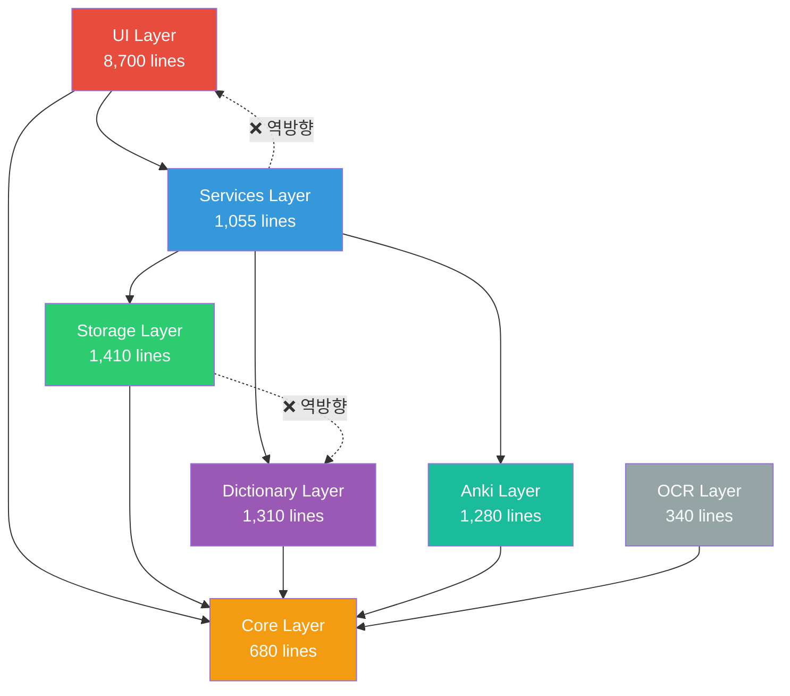
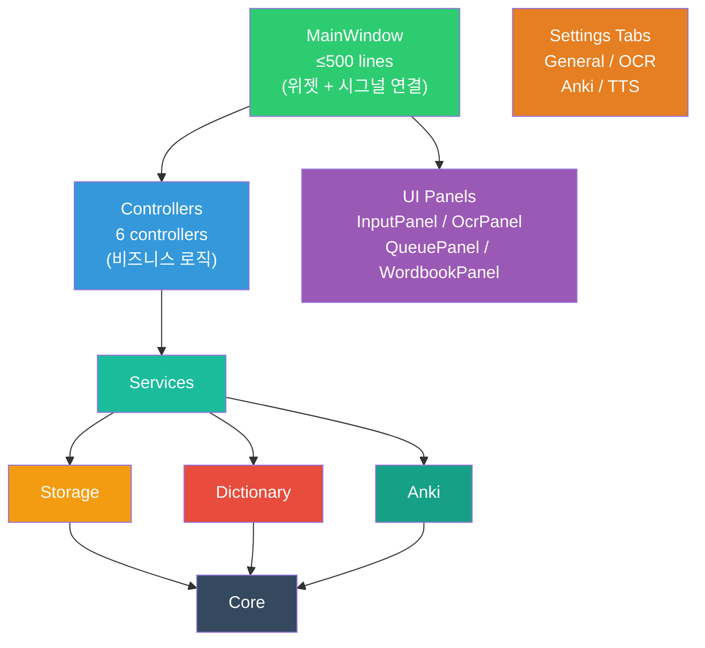

# jelly dict 리팩토링 계획서

> **작성일**: 2026-06-05  
> **기준 버전**: v2.0 (262 passed, 3 warnings)  
> **대상**: `app_files/jelly_dict/` 이하 전체 Python 소스 + 셸 스크립트

---

## 1. 현재 코드베이스 요약

### 1.1 규모

| 레이어 | 파일 수 | 총 라인 수 | 비고 |
|--------|---------|-----------|------|
| UI (`app/ui/`) | 21 | ~8,700 | **전체의 55%** — 3개 God class가 5,100줄 차지 |
| Core (`app/core/`) | 6 | ~680 | 도메인 모델, 설정, 에러 |
| Dictionary (`app/dictionary/`) | 7 | ~1,310 | 네이버 크롤러 + 파서 |
| Services (`app/services/`) | 8 | ~1,055 | 조회/저장/내보내기/TTS |
| Storage (`app/storage/`) | 7 | ~1,410 | Excel/SQLite/설정 |
| Anki (`app/anki/`) | 12 | ~1,280 | APKG/TTS/카드 렌더 |
| OCR (`app/ocr/`) | 6 | ~340 | Vision OCR 프로바이더 |
| Main | 1 | ~205 | 앱 진입점 |
| **Python 합계** | **68** | **~15,700** | |
| 테스트 (`tests/`) | 36 | ~4,500+ | |
| 셸 스크립트 | 7 | ~2,800+ | installer 41KB 포함 |

### 1.2 파일 크기 상위 10개 (핵심 리팩토링 대상)

| 순위 | 파일 | 라인 수 | 문제 유형 |
|------|------|---------|----------|
| 1 | `ui/main_window.py` | 1,890 | ⚠️ God Class |
| 2 | `ui/word_input_view.py` | 1,818 | ⚠️ God Class |
| 3 | `ui/settings_view.py` | 1,393 | ⚠️ God Class |
| 4 | `ui/entry_detail_dialog.py` | 544 | 보통 |
| 5 | `storage/excel_writer.py` | 465 | God Module |
| 6 | `ui/tts_install_worker.py` | 433 | 로직 혼재 |
| 7 | `dictionary/naver_english.py` | 418 | 보통 |
| 8 | `ui/word_list_view.py` | 409 | 보통 |
| 9 | `storage/cache_store.py` | 346 | 다중 책임 |
| 10 | `ui/controllers/export_controller.py` | 315 | 보통 |

### 1.3 아키텍처 의존성 흐름 (현재)



> [!WARNING]
> 빨간 점선은 레이어 의존성 위반을 나타냅니다.
> - `cache_store.py` → `naver_english.py` (Storage→Dictionary)
> - `export_preflight.py` → `export_options.py` (Services→UI)

---

## 2. 발견된 문제 분류

### 2.1 P0 — 버그 / 즉시 수정

| # | 위치 | 문제 | 영향 |
|---|------|------|------|
| P0-1 | `naver_japanese.py:277` | `extract_number` 함수가 `parser_utils`에서 import한 동명 함수를 재정의(shadow)함 | 일본어 파서 동작이 의도와 다를 수 있음 |
| P0-2 | `models.py:207` | `first_meaning_hint()` 내부에 불필요한 `import re` (모듈 레벨 L4에서 이미 import) | 사소하지만 코드 혼란 |

### 2.2 P1 — 아키텍처 위반 / 구조적 문제

| # | 위치 | 문제 | 해결 방향 |
|---|------|------|----------|
| P1-1 | `export_preflight.py:8` | `app.ui.export_options.ExportPlan`을 Services 레이어에서 import → **의존성 역전** | `ExportPlan`을 `app.core` 또는 `app.services`로 이동 |
| P1-2 | `cache_store.py:339-346` | `naver_english.cache_entry_needs_refresh` import → **Storage→Dictionary 역방향 의존** | staleness 체크 함수를 주입받거나 `core`에 인터페이스 배치 |
| P1-3 | `excel_writer.py:38-57` | `excel_reader`와 `excel_serializer` 심볼을 re-export → 혼란스러운 import 경로 | 호출자가 올바른 모듈에서 직접 import하도록 변경 |
| P1-4 | 코드 3곳 중복 | Excel 행 → `VocabularyEntry` 변환이 `excel_serializer`, `export_service` 두 곳(3개 함수)에 중복 | `excel_serializer.row_to_entry()` 하나로 통합 |
| P1-5 | `_wav_to_mp3()` 2곳 중복 | `kokoro_provider.py:252-280`와 `voicevox_provider.py:198-223`에 동일 코드 | `tts/transcode.py`로 추출 |
| P1-6 | `_now()` 3곳 중복 | `models.py:32`, `duplicate_checker.py:118`, `cache_store.py:15`에 동일 타임스탬프 헬퍼 | `core/utils.py`로 통합 |
| P1-7 | `_new_temp_path()` 2곳 중복 | `apkg_exporter.py:158-165`, `tsv_exporter.py:51-58` 동일 코드 | 공유 유틸로 추출 |

### 2.3 P2 — God Class / 대형 모듈 분할

| # | 대상 | 현재 라인 | 문제 | 분할 안 |
|---|------|----------|------|---------|
| P2-1 | `main_window.py` | 1,890 | 12+ 책임 혼재: 조회 큐, 저장, 실행취소, TTS, 내보내기, Playwright 예열, 상태 등 | → 5개 컨트롤러 추출 |
| P2-2 | `word_input_view.py` | 1,818 | 입력 패널 + OCR + 큐 + 단어장 + 확장/축소 모두 하나의 위젯 | → 4~5개 서브 위젯 추출 |
| P2-3 | `settings_view.py` | 1,393 | 일반/OCR/Anki/TTS 설정 + TTS 설치 로직이 한 다이얼로그 | → 탭별 위젯 + 설치 다이얼로그 분리 |
| P2-4 | `cache_store.py` | 346 | entry cache + recent lookups + app state 3개 테이블 관리 | → 역할별 3개 스토어 |
| P2-5 | `excel_writer.py` | 465 | 파일 생성 + 행 추가 + 삭제 + 백업 + 스키마 관리 | → 백업/스키마 매니저 분리 |
| P2-6 | `Settings` 데이터클래스 | 37 필드 | 너무 많은 필드가 하나에 | → `TtsSettings`, `AnkiSettings` 등 서브 그룹 |
| P2-7 | `models.py` | 306 | 도메인 모델 + 표시용 포매팅 함수 혼재 | → `core/meaning_display.py` 분리 |
| P2-8 | `tts_install_worker.py` | 433 | 설치 로직 + UI 진행상황 → Worker에 비즈니스 로직 과다 | → 설치 서비스 + 얇은 Worker 분리 |

### 2.4 P3 — 코드 품질 / 스레드 안전성

| # | 위치 | 문제 | 심각도 |
|---|------|------|--------|
| P3-1 | `playwright_client.py:63-71` | `_RateLimiter.wait()`가 lock을 잡은 채 `time.sleep()` → 다른 스레드 차단 | 중간 |
| P3-2 | `sqlite_store.open_db()` | 매 호출마다 `CREATE TABLE IF NOT EXISTS` + 마이그레이션 실행 | 낮음(성능) |
| P3-3 | `SettingsStore._cache` | read/write에 lock 없음 → 멀티스레드 레이스 가능 | 낮음~중간 |
| P3-4 | 타입 힌트 누락 | TTS/export 모듈의 `settings` 파라미터, 파서의 `soup` 파라미터 등 주요 지점 | 낮음 |
| P3-5 | 에러 처리 불일치 | 딕셔너리 파서: 일부는 빈 리스트 반환, 일부는 raise / 서비스: broad `Exception` catch | 낮음 |
| P3-6 | `main.py` macOS 코드 | macOS 전용 프로세스 관리가 main에 직접 들어있음 | 낮음 |

### 2.5 P4 — 테스트 커버리지 / 인프라

| # | 문제 | 설명 |
|---|------|------|
| P4-1 | 테스트 없는 모듈 14개 | `playwright_client`, `naver_crawler`, `parser_utils`, `config`, `url_safety`, `excel_reader`, `excel_serializer`, `sqlite_store`, `preview_editor_view`, `export_worker`, `startup_perf`, `tts_install_worker`, `main.py`, `packaging/` |
| P4-2 | 테스트 조직 부재 | unit/integration 분리 없음, `test_word_input_view.py`가 700줄로 과대 |
| P4-3 | 공유 fixture 부족 | mock settings/cache 스토어, 가짜 엔트리 생성이 여러 테스트에 중복 |
| P4-4 | 셸 스크립트 중복 | Python 감지, venv 활성화, 색상코드, 라이선스 텍스트가 3~4개 스크립트에 중복 |

---

## 3. 리팩토링 실행 계획

### Phase 1: 즉시 수정 (P0 + P1 핵심) — 예상 1~2일

> [!IMPORTANT]
> 기존 테스트 262개가 모두 통과하는 상태를 유지하면서 진행합니다.

#### 1-1. 버그 수정

```diff
# naver_japanese.py — 중복 함수 제거
- def extract_number(text: str) -> str | None:
-     ...  # L277-283 삭제, parser_utils에서 import한 것 사용
```

```diff
# models.py:207 — 불필요한 import 제거
  def first_meaning_hint(senses):
-     import re
      ...
```

#### 1-2. 의존성 역전 해소

| 작업 | 변경 내용 |
|------|----------|
| `ExportPlan` 이동 | `app/ui/export_options.py` → `app/core/export_plan.py`로 이동. `export_preflight.py`와 UI 양쪽에서 새 위치 import |
| cache staleness 분리 | `cache_store.py`에서 `naver_english` import 제거. `needs_refresh` 판별 함수를 `core/cache_policy.py`에 두거나, `CacheStore.get()` 호출자가 판별 후 전달 |

#### 1-3. 코드 중복 통합

| 대상 | 현재 | 리팩토링 후 |
|------|------|-----------|
| `_now()` 3곳 | models, duplicate_checker, cache_store | `core/utils.py` → `utc_now_str()` 하나로 통합 |
| `_wav_to_mp3()` 2곳 | kokoro_provider, voicevox_provider | `anki/tts/transcode.py` → `wav_to_mp3()` |
| `_new_temp_path()` 2곳 | apkg_exporter, tsv_exporter | `anki/temp_utils.py` → `new_temp_path()` |
| Entry-from-row 3곳 | excel_serializer, export_service (2개 함수) | `excel_serializer.row_to_entry()` 하나로, export_service는 위임 |
| `_collect_related` / `_aggregate_relations` | naver_japanese, naver_english | `parser_utils.aggregate_relations()` 하나로 |

#### Phase 1 완료 기준
- `pytest` 262 passed 유지
- `from app.ui` import가 services/storage 레이어에 없음
- `from app.dictionary` import가 storage 레이어에 없음
- `grep -r "def _now\|def _now_utc"` 결과가 1곳뿐

---

### Phase 2: God Class 분할 — UI 레이어 — 예상 3~5일

> [!IMPORTANT]
> dev.md의 제약사항을 준수합니다: "UI 시그널은 동일하게 유지하면서 컨트롤러로 로직을 옮길 수 있다. 위젯 트리는 보존한다."

#### 2-1. `main_window.py` (1,890줄) 분할

현재 `MainWindow`가 담당하는 12+ 책임을 아래 컨트롤러로 분리:

```text
app/ui/controllers/
├── export_controller.py      # (기존, 보강)
├── wordbook_controller.py    # (기존, 보강 — 삭제/되돌리기 이동)
├── lookup_queue_controller.py # ← 신규: 큐 관리, 순차 조회, 재시도
├── save_controller.py         # ← 신규: 미리보기, 중복 체크, 저장, 되돌리기
├── tts_background_controller.py # ← 신규: TTS 백그라운드 큐
└── window_state_controller.py   # ← 신규: 윈도우 상태 저장/복원
```

**분할 원칙:**
- `MainWindow`는 위젯 생성 + 시그널/슬롯 연결 + 컨트롤러 초기화만 담당
- 비즈니스 로직은 컨트롤러가 소유
- 각 컨트롤러는 필요한 서비스를 생성자 주입으로 받음
- 시그널 시그니처는 변경하지 않음

**목표**: `main_window.py` → ~500줄 이하

#### 2-2. `word_input_view.py` (1,818줄) 분할

```text
app/ui/
├── word_input_view.py        # ← 조합 컨테이너 (~300줄)
├── panels/
│   ├── input_panel.py        # ← 텍스트 입력 + 언어 선택 + 조회 버튼
│   ├── ocr_panel.py          # ← OCR 후보 칩 표시/상호작용
│   ├── queue_panel.py        # ← 조회 대기열 칩 표시
│   └── wordbook_panel.py     # ← 단어장 리스트 + 헤더 + 검색 + 정렬
├── widgets/
│   ├── chip_widget.py        # ← OCR/큐 공통 칩 컴포넌트 (신규)
│   ├── wordbook_row.py       # (기존)
│   ├── anki_export_button.py # (기존)
│   └── language_menu_item.py # (기존)
```

**핵심 포인트:**
- `WordInputView`는 패널들을 조합하는 레이아웃 컨테이너로 축소
- OCR 칩과 큐 칩은 시각/상호작용 패턴이 유사 → `ChipWidget`으로 통합
- 확장/축소 애니메이션 로직은 `WordInputView`에 유지 (패널 간 조율이 필요)
- 인라인 QSS는 `theme.qss`로 최대한 이동

**목표**: `word_input_view.py` → ~300줄, 각 패널 200~400줄

#### 2-3. `settings_view.py` (1,393줄) 분할

```text
app/ui/
├── settings_view.py          # ← 탭 컨테이너 (~200줄)
├── settings/
│   ├── general_tab.py        # ← 경로, 캐시, 미리보기, 중복 처리
│   ├── ocr_tab.py            # ← OCR 프로바이더, API 키
│   ├── anki_tab.py           # ← Anki 경로, AnkiConnect
│   └── tts_tab.py            # ← TTS 엔진 선택, 음성 선택
├── tts_install_dialog.py     # ← TTS 설치 전용 다이얼로그 (tts_install_worker에서 분리)
```

**목표**: `settings_view.py` → ~200줄, 각 탭 200~350줄

#### Phase 2 완료 기준
- 기존 시그널 시그니처 100% 유지
- `main_window.py` ≤ 500줄
- `word_input_view.py` ≤ 400줄
- `settings_view.py` ≤ 300줄
- `pytest` 262 passed 유지
- 오프스크린 렌더 캡처로 UI 동일성 확인

---

### Phase 3: 백엔드 모듈 정리 — 예상 2~3일

#### 3-1. `cache_store.py` (346줄) 분할

```text
app/storage/
├── sqlite_store.py           # (기존 — 베이스)
├── entry_cache.py            # ← entries_cache 테이블
├── recent_store.py           # ← recent_lookups 테이블
├── app_state_store.py        # ← app_state 테이블
├── cache_store.py            # ← 위 3개를 묶는 facade (호환 유지)
```

SQLite 연결 관리 개선:
- 매 호출 `open_db()` → 초기화 시 1회 연결 + 이후 재사용
- `CREATE TABLE IF NOT EXISTS`와 마이그레이션은 초기화 시 1회만

#### 3-2. `excel_writer.py` (465줄) 정리

```text
app/storage/
├── excel_writer.py           # ← 행 추가/삭제만 (~250줄)
├── excel_backup.py           # ← 백업 관리
├── excel_schema.py           # ← 컬럼 확인/마이그레이션
├── excel_reader.py           # (기존)
├── excel_serializer.py       # (기존)
```

- `excel_writer.py`의 `excel_reader`/`excel_serializer` re-export 제거
- 호출자는 올바른 모듈에서 직접 import

#### 3-3. `Settings` 데이터클래스 분할

```python
# settings_store.py — 리팩토링 후 구조

@dataclass
class ExcelSettings:
    english_path: str
    japanese_path: str
    backup_enabled: bool = True
    ...

@dataclass
class AnkiSettings:
    export_path: str
    ankiconnect_enabled: bool = False
    ankiconnect_url: str = "http://127.0.0.1:8765"
    ...

@dataclass
class TtsSettings:
    enabled: bool = False
    english_engine: str = ""
    japanese_engine: str = ""
    ...

@dataclass
class OcrSettings:
    provider: str = "apple_vision"
    ...

@dataclass
class Settings:
    excel: ExcelSettings
    anki: AnkiSettings
    tts: TtsSettings
    ocr: OcrSettings
    cache_enabled: bool = True
    preview_before_save: bool = False
    ...
```

#### 3-4. `models.py` 표시 함수 분리

```text
app/core/
├── models.py                 # ← 순수 도메인 모델만 (~160줄)
├── meaning_display.py        # ← build_meanings_summary, wordbook_meaning_hint 등 (~150줄)
├── utils.py                  # ← utc_now_str 등 공유 유틸
```

#### 3-5. `main.py` 플랫폼 코드 분리

```text
app/
├── main.py                   # ← Qt 설정 + 앱 시작만 (~100줄)
├── platform/
│   └── macos.py              # ← macOS 프로세스 관리, 메뉴 갱신 (~100줄)
```

#### Phase 3 완료 기준
- `pytest` 262 passed 유지
- `cache_store.py` → facade 포함 각 파일 ≤ 150줄
- `excel_writer.py` ≤ 250줄
- 외부 API 호환 유지 (기존 import 경로는 facade 또는 `__init__.py`로 유지 가능)

---

### Phase 4: 코드 품질 / 스레드 안전성 — 예상 1~2일

#### 4-1. 스레드 안전성 수정

| 대상 | 수정 |
|------|------|
| `_RateLimiter.wait()` | lock 안에서 대기 시간만 계산 → lock 밖에서 `time.sleep()` |
| `CacheStore` 연결 | 초기화 시 연결 생성, `threading.Lock`으로 write 보호 |
| `SettingsStore._cache` | `threading.Lock` 추가 |

#### 4-2. 타입 힌트 보강

우선 대상:
- `apkg_exporter.py` — `settings: Settings | None`
- `tts/pipeline.py` — `settings: Settings`
- 모든 TTS provider `__init__` — `settings: Settings`
- `naver_english.py` 파서 함수 — `soup: BeautifulSoup` 파라미터
- `export_preflight.py` — `progress_callback: Callable[[str], None] | None`
- `excel_writer.py` — `resolver` 콜백 타입 명시

#### 4-3. 에러 처리 표준화

- 딕셔너리 파서: 파싱 실패 시 `ParseError` 통일 (빈 리스트 반환 제거)
- 서비스 레이어: broad `Exception` → 구체 에러 타입 (`CacheError`, `NetworkError`)
- `naver_crawler.py:108` lazy import → 모듈 레벨 import으로 변경

#### 4-4. 인라인 QSS → `theme.qss` 통합

- `word_input_view.py`, `settings_view.py`, `main_window.py`의 인라인 `setStyleSheet()` 호출을 조사
- 재사용되는 스타일은 `theme.qss`로 이동, objectName 기반 선택자 사용
- 동적 스타일(상태 변화에 따른)만 인라인 유지

#### Phase 4 완료 기준
- `mypy --strict` 핵심 모듈 통과 (core, services, storage)
- `_RateLimiter` lock 밖 sleep 확인
- 인라인 QSS 50% 이상 `theme.qss`로 이동

---

### Phase 5: 테스트 인프라 강화 — 예상 2~3일

#### 5-1. 테스트 구조 재편

```text
tests/
├── conftest.py               # ← 공유 fixture 확장
├── unit/                     # ← 순수 단위 테스트
│   ├── core/
│   ├── dictionary/
│   ├── services/
│   ├── storage/
│   └── anki/
├── integration/              # ← Qt 위젯 필요 테스트
│   ├── ui/
│   └── e2e/
└── fixtures/                 # (기존)
```

#### 5-2. 공유 fixture 추출

`conftest.py`에 추가할 공통 fixture:

```python
@pytest.fixture
def mock_settings() -> Settings:
    """여러 테스트에서 중복되는 기본 Settings 생성"""
    ...

@pytest.fixture
def mock_cache_store(tmp_home) -> CacheStore:
    """격리된 CacheStore"""
    ...

@pytest.fixture
def sample_entry() -> VocabularyEntry:
    """테스트용 영어 단어 엔트리"""
    ...

@pytest.fixture
def sample_japanese_entry() -> VocabularyEntry:
    """테스트용 일본어 단어 엔트리"""
    ...
```

#### 5-3. 테스트 없는 모듈 커버리지 추가 (우선순위 순)

| 우선도 | 대상 | 테스트 유형 | 이유 |
|--------|------|-----------|------|
| 높음 | `playwright_client.py` | Mock 기반 unit | 네트워크 계층 핵심, 스레드 안전성 검증 |
| 높음 | `excel_serializer.py` | Unit | 데이터 변환 핵심, 중복 제거 후 검증 필수 |
| 높음 | `config.py` | Unit | 경로 계산 검증 |
| 중간 | `url_safety.py` | Unit | 보안 관련 |
| 중간 | `parser_utils.py` | Unit | 파서 공통 함수 |
| 중간 | `excel_reader.py` | Unit | 기존 excel_writer 테스트에서 분리 |
| 낮음 | `tts_install_worker.py` | Integration | 설치 로직 검증 |
| 낮음 | `startup_perf.py` | Unit | 작은 모듈 |

#### 5-4. `test_word_input_view.py` 분할

```text
tests/integration/ui/
├── test_input_panel.py
├── test_ocr_panel.py
├── test_queue_panel.py
├── test_wordbook_panel.py
└── test_word_input_view_layout.py
```

#### Phase 5 완료 기준
- 테스트 300+ passed (기존 262 + 신규 ~40)
- `pytest tests/unit/` 과 `pytest tests/integration/` 독립 실행 가능
- 중복 fixture 코드 80% 제거

---

### Phase 6: 셸 스크립트 정리 — 예상 1~2일

#### 6-1. 공통 함수 추출

```text
app_files/scripts/
├── lib/
│   └── common.sh             # ← 공통 함수 라이브러리
├── quickstart.sh             # ← source lib/common.sh
├── run.sh                    # ← source lib/common.sh
├── cleanup.sh
└── make_user_package.sh
```

`lib/common.sh`에 포함할 함수:
- `detect_python()` — Python 버전 탐색 (현재 3곳 중복)
- `activate_venv()` — venv 활성화 (현재 2곳 중복)
- `resolve_repo_root()` — repo 루트 경로 계산 (현재 4곳 중복)
- `setup_colors()` — 터미널 색상 코드 정의 (현재 2곳 중복)
- `log_message()` — 로그 출력 포맷

#### 6-2. 라이선스 텍스트 중앙화

```text
app_files/
├── LICENSE                   # (기존)
├── LICENSE_NOTICE.txt        # ← 설치 시 보여줄 라이선스 안내문 (1곳에서 관리)
```

`Install jelly dict.command`와 `quickstart.sh` 모두 이 파일을 읽어서 표시.

#### 6-3. Install 명령어 분리

| 현재 (41KB 단일 파일) | 리팩토링 후 |
|----------------------|-----------|
| UI 렌더링 + 설치 로직 + 라이선스 + 환경 검사 | UI 래퍼 (Install command) + 엔진 (quickstart.sh) |

`Install jelly dict.command`을 얇은 TUI 래퍼로 축소하고, 실제 설치 로직은 `quickstart.sh`에 위임.

#### Phase 6 완료 기준
- 중복 함수 제거 확인: `grep -r "detect_python\|find_python"` 결과 `common.sh` 1곳
- `Install jelly dict.command` 크기 50% 감소 목표
- 기존 설치 흐름 동일하게 동작 (수동 테스트)

---

## 4. 리팩토링 후 목표 아키텍처



### 목표 파일 크기 분포

| 임계값 | 현재 | 리팩토링 후 목표 |
|--------|------|----------------|
| 500줄 초과 파일 | 3개 (1890, 1818, 1393) | 0개 |
| 300~500줄 파일 | 7개 | ≤ 5개 |
| 200~300줄 파일 | 8개 | ~12개 (분할 결과) |
| 200줄 이하 파일 | 나머지 | 대부분 |

---

## 5. 실행 원칙

> [!CAUTION]
> 아래 원칙은 `dev.md`의 "작업 시 주의" 항목을 기반으로 합니다. 리팩토링 전 과정에서 준수합니다.

1. **점진적 진행**: Phase별로 `pytest` 전체 통과를 확인한 후 다음 Phase 진행
2. **시그널 호환**: UI 시그널 시그니처를 변경하지 않음
3. **위젯 트리 보존**: DOM 구조(QWidget 계층)는 유지, 내부 코드만 재배치
4. **Anki 호환**: 모델 ID, GUID 알고리즘, `FIELD_ORDER` prefix 변경 금지
5. **Excel 데이터 보존**: 사용자 Excel이 기준 데이터. 리팩토링으로 저장/읽기 로직 변경 시 Excel 포맷 호환 검증
6. **네트워크 정책 유지**: `Config.ALLOWED_DOMAINS` 우회 금지, 자동 온라인 요청 추가 금지
7. **사용자 데이터 안전**: `~/Documents/jelly-dict/` 삭제 금지
8. **TTS 라이선스 분리**: subprocess 격리 구조 유지
9. **커밋 단위**: Phase 내에서도 기능 단위로 커밋, 각 커밋에서 테스트 통과

---

## 6. 우선순위 요약 로드맵

```text
Week 1:  Phase 1 (P0 버그 + P1 아키텍처 위반)     ████████░░  1~2일
         Phase 2 시작 (main_window 컨트롤러 추출)  ████░░░░░░  

Week 2:  Phase 2 계속 (word_input_view 분할)       ████████░░  3~5일
         Phase 2 마무리 (settings_view 분할)        ████████░░  

Week 3:  Phase 3 (백엔드 모듈 정리)                ████████░░  2~3일
         Phase 4 (코드 품질)                        ██████░░░░  1~2일

Week 4:  Phase 5 (테스트 강화)                      ████████░░  2~3일
         Phase 6 (셸 스크립트)                      ██████░░░░  1~2일
```

**전체 예상 기간: 2~4주** (작업 강도에 따라)

---

## 7. 리스크 & 대응

| 리스크 | 가능성 | 영향 | 대응 |
|--------|--------|------|------|
| God class 분할 시 시그널 연결 누락 | 높음 | 높음 | 오프스크린 렌더 캡처 + 수동 E2E 테스트 |
| QSS 이동 시 스타일 깨짐 | 중간 | 중간 | 스크린샷 비교 자동화 |
| CacheStore 분할 시 마이그레이션 | 낮음 | 높음 | 기존 DB 파일 자동 마이그레이션 로직 유지 |
| 셸 스크립트 refactor 시 installer 동작 변화 | 중간 | 높음 | 클린 환경에서 설치 E2E 테스트 |
| 테스트 디렉토리 재편 시 CI 경로 깨짐 | 낮음 | 낮음 | `pyproject.toml` testpaths 업데이트 |
